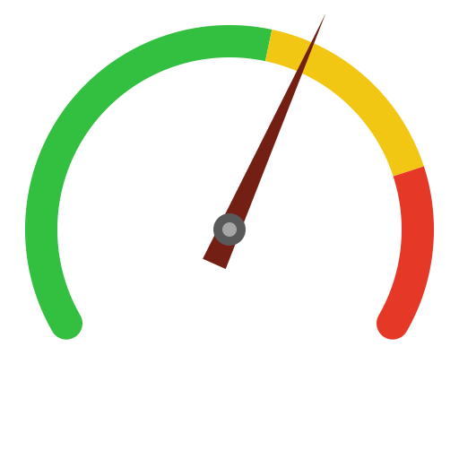

# SVGLib

A Swift package for generating SVG files programmatically. Provides geometric primitives, path building with arc and fillet support, and document output helpers.

## Requirements

- Swift 6.0+
- macOS 14+

## Installation

Add SVGLib as a dependency in your `Package.swift`:

```swift
dependencies: [
    .package(url: "https://github.com/kalahari/swift-svglib", from: "1.0.0"),
],
targets: [
    .target(name: "MyTarget", dependencies: ["SVGLib"]),
]
```

## Example

The repo includes a runnable example that generates a simple gauge SVG — colored arc zones, a triangle pointer, and a hub circle.

```
swift run SVGLibExample
```

Output is written to `output/gauge.svg`.



## Usage

### Colors

`hexRGB` and `hexGray` produce CSS hex color strings from 0–1 components:

```swift
let red   = hexRGB(0.9, 0.2, 0.1)   // "#E63319"
let steel = hexRGB(0.2, 0.4, 0.7)   // "#3366B3"
let white = hexGray(1.0)             // "#FFFFFF"
```

### Geometry

The core types are `Point`, `Line`, `Circle`, and `Arc`. Helper functions cover distances, intersections, offsets, and fillet centers.

```swift
let center = Point(x: 512, y: 512)
let ring = Arc(center: center, radius: 400, start: 270, sweep: 360)

// Point on the arc at 25% of its sweep
let pt = svgPtAtArcFraction(0.25, arc: ring)

// Offset a line 10 units to the right
let shifted = offsetLine(line: Line(p0: pt, to: center), distance: 10)
```

Angles use SVG y-down convention: 0° is 3:00, 90° is 6:00, 270° is 12:00. Positive sweep is clockwise.

### Building paths

`buildPath` assembles an SVG `d` string from a `[PathSegment]` array. Segments can be `.move`, `.line`, or `.arc`. Any `nil` endpoint (often the result of a failed intersection) causes the whole path to return `nil`, making error handling straightforward.

Pass `filletRadius` to round every non-tangent junction automatically:

```swift
let segments: [PathSegment] = [
    .line(to: Point(x: 100, y: 400)),
    .line(to: Point(x: 512, y: 100)),
    .line(to: Point(x: 924, y: 400)),
]
let d = buildPath(segments: segments, filletRadius: 20)
```

### Arc shapes

`arcShape` produces a filled, closed arc band between two fractions of an `Arc`, with optional rounded caps:

```swift
let arc = Arc(center: Point(x: 512, y: 512), radius: 380, start: 160, sweep: 220)

// Three coloured zones making up the full arc
let zones: [(Double, Double, String)] = [
    (0.0, 0.6, hexRGB(0.2, 0.75, 0.3)),
    (0.6, 0.85, hexRGB(0.9, 0.75, 0.1)),
    (0.85, 1.0, hexRGB(0.9, 0.2, 0.15)),
]
let parts = zones.enumerated().map { i, z in
    arcShape(t0: z.0, t1: z.1, arc: arc, thickness: 48, fill: z.2,
             roundStart: i == 0, roundEnd: i == zones.count - 1)
}
```

### Basic shapes

```swift
svgCircle(center: Point(x: 512, y: 512), r: 30, fill: hexGray(0.4))
svgLine(Line(p0: a, p1: b), width: 3, stroke: "#FF0000")
svgArc(arc, width: 2, stroke: hexGray(0.6))
```

### Document output

Wrap content in an `<svg>` root element and write it to disk:

```swift
let svg = svgDoc(parts.joined(separator: "\n"), width: 1024, height: 1024)
writeSVG(svg, name: "output.svg", directory: "assets")
```

`writeSVG` creates intermediate directories as needed and exits with code 1 on failure.

## API reference

Full API documentation is published at **https://kalahari.github.io/swift-svglib/documentation/svglib/**.

| File | Contents |
|------|----------|
| `Color.swift` | `hexRGB`, `hexGray` |
| `Geometry.swift` | `Point`, `Line`, `Circle`, `Arc`, `LineCoefficients`; `distance`, `midpoint`, `lineLength`, `lineIntersection`, `offsetLine`, `extendLine`, `lineCircleIntersections`, `commonTangents`, `filletCenter`, `areTangent`, `arcAngleDegrees`, `svgPointAtAngle`, `svgPtAtArcFraction` |
| `Path.swift` | `PathSegment`, `buildPath`, `arcPath`, `arcShape` |
| `Shapes.swift` | `svgCircle`, `svgLine`, `svgArc`, `insetTriangle` |
| `Document.swift` | `svgCoord`, `svgDoc`, `writeSVG` |

## License

MIT
